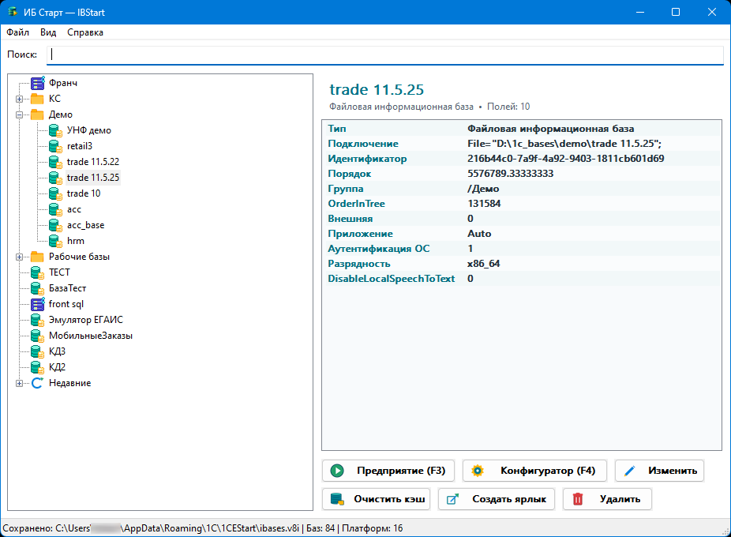

# IBStart


> Лёгкий менеджер запусков информационных баз 1С:Предприятие

[](https://github.com/ant-m13/ibstart/actions/workflows/build.yml)
[](https://github.com/ant-m13/ibstart/releases/latest)
[](LICENSE)

**IBStart (ИБ Старт)** — стабильное независимое нативное приложение Windows для просмотра списка баз, хранящегося в `ibases.v8i`, и запуска установленных клиентов 1С:Предприятие 8.3/8.5.

Номер продукта в формате SemVer хранится в единственном файле [`cmake/IBStartVersion.cmake`](cmake/IBStartVersion.cmake). Он автоматически попадает в окно **Справка → О программе**, свойства `IBStart.exe`, Windows manifest, имя ZIP-архива, тег и GitHub Release.

IBStart написан на C++20 и Win32 API, не требует .NET, браузерного движка или прав администратора. Для основной работы подключение к сети не нужно. В релизе поставляется один `IBStart.exe` с статическим MSVC Runtime. Телеметрии, аналитики и автоматического обновления в программе нет; только по явной команде пользователя приложение обращается к GitHub, чтобы проверить наличие новой версии.



## Поддержка

- Windows 10 и Windows 11, x64;
- установленная 1С:Предприятие 8.3 или 8.5, 32- или 64-разрядный клиент;
- UTF-8 `ibases.v8i` с BOM и без BOM, русские имена и пути с пробелами.

Первый запуск ищет стандартный файл пользователя (`%APPDATA%\1C\1CEStart\ibases.v8i` и распространённые альтернативы). Если он не найден, окно остаётся пустым: выберите существующий список через **Файл → Открыть список баз** либо добавьте файловую базу.

## Возможности

- Чтение, сохранение иерархии групп/баз из активного `ibases.v8i`; неизвестные поля не удаляются и не меняют порядок.
- Перед записью — резервная копия `ibases.v8i.bak_YYYYMMDD_HHMMSS`, хранится до пяти последних; запись идёт через временный файл и атомарную замену. Внешнее изменение файла блокирует молчаливую перезапись.
- Компактное изменяемое окно: поиск, дерево, карточка базы, запуск **Предприятия** (`F3`) и **Конфигуратора** (`F4`), добавление файловой базы/группы, редактирование, удаление только записи, создание ярлыка и безопасная очистка известных каталогов кэша.
- Автопоиск платформ через Program Files, реестр и настраиваемые пути; в режиме «Авто» предпочитается x64, затем x86. Командная строка строится отдельно от вызова `CreateProcessW` и корректно экранирует Unicode-аргументы.
- Данные приложения находятся в `%LOCALAPPDATA%\IBStart\`: общие параметры, история открытых списков и настройка показа тегов — в `settings.json`, а метаданные каталога (избранное, история последних 20 запусков, даты запуска, теги, их цвета и сортировка) — в `catalog-state.json`. История запусков не сохраняет параметры запуска.
- Теги назначаются в отдельной форме с флажками и быстрым добавлением нового. Их стиль настраивается через палитру цветов с живым предпросмотром; совпадения поиска внутри цветных меток выделяются жирным.
- Режим «Простой режим» перестраивает интерфейс в компактный режим для запуска и навигации; это не механизм разграничения доступа.
- Ярлык рабочего стола запускает IBStart с идентификатором базы, без пароля в командной строке.
- Команда **Справка → Проверить обновления…** в фоне сопоставляет встроенную версию с последним стабильным GitHub Release и при наличии новой версии предлагает открыть её страницу. При ошибке в диалоге доступна кнопка открытия текущего файла журнала. Программа ничего не скачивает и не заменяет сама.
- Команда **Справка → О программе** показывает фактическую версию собранного приложения.
- Строка состояния показывает путь к активному списку, число баз в активном каталоге и число обнаруженных платформ 1С.
- Поиск по дереву не зависит от регистра; совпавшие части имён подсвечиваются зелёным.
- Контекстное меню дерева дублирует запуск и операции со списком, позволяет добавлять элементы внутрь выбранной группы, перемещать базу в выбранную папку, быстро добавлять теги и менять порядок соседних элементов; его команды показывают отдельной правой колонкой работающие сочетания клавиш.
- Окно и исполняемый файл имеют собственный значок IBStart; дерево и основные кнопки используют компактные пиктограммы, а свойства выбранной базы показаны в цветной карточке.
- В дереве файловая база отмечена зелёной базой с документом, серверная — фиолетовой стойкой с сетевыми узлами; подписи кнопок автоматически получают полную ширину с учётом значков и масштаба Windows.
- Добавление и изменение базы открывают единый редактор рядом с главным окном: имя в списке, файловый каталог, веб-адрес либо кластер и имя серверной базы, а также совместимые параметры запуска из `ibases.v8i`.

## Быстрый старт

1. Скачайте `IBStart.exe` из артефакта/релиза и запустите его как обычный пользователь.
2. Проверьте путь в строке состояния. При необходимости выберите другой `ibases.v8i` в меню **Файл**.
3. Выберите базу и нажмите `F3` или `F4`.

Если подходящая платформа не обнаружена, IBStart не подменяет её случайной версией: укажите установку через настройки данных либо установите штатный клиент 1С.

## Сборка из исходников

Требуются Visual Studio Build Tools 2022 или новее с компонентом **Desktop development with C++**, CMake 3.24+, Ninja и Windows SDK. Откройте x64 Native Tools Command Prompt в корне репозитория:

```powershell
cmake --preset msvc-x64-release
cmake --build --preset msvc-x64-release
ctest --preset msvc-x64-release
```

Готовый файл: `out\build\msvc-x64-release\IBStart.exe`. После каждой Release-сборки CMake останавливает сборку, если размер EXE превышает 8 МиБ. Целевой размер — до 5 МиБ; упаковщики исполняемых файлов не применяются. Дополнительный preset `vs2022-x64-release` сохранён для Visual Studio 2022.

## Portable mode

Создайте рядом с `IBStart.exe` пустой файл `IBStart.portable`. Тогда `settings.json`, `catalog-state.json` и логи хранятся в `data\` рядом с программой. Сам `ibases.v8i` туда не копируется и остаётся основным файлом списка. Если папка недоступна для записи, программа покажет ошибку и завершится без повторных попыток.

## `ibases.v8i` и безопасность

IBStart не удаляет каталоги файловых баз: действие «Удалить» удаляет только секцию из списка. При сохранении сохраняются поддерживаемые поля `Connect`, `ID`, `Folder`, `OrderInList`, `OrderInTree`, `Version`, `DefaultVersion`, `App`, `DefaultApp`, `WA`, `External`, `Locale`, `ClientConnectionSpeed`, `AppArch`, `AdditionalParameters` и незнакомые поля сторонних инструментов.

Дополнительные параметры передаются пользователем как текст. IBStart не создаёт отдельное хранилище логинов/паролей. Если введён `/P`, программа предупреждает, что пароль может оказаться в открытом виде в `ibases.v8i`; в логах значения после `/P`, `password` и `token` маскируются. Не передавайте пароль через ярлык.

## Текущие ограничения

- Очистка ограничена явными кэш-подкаталогами и намеренно не пытается угадывать или удалять пользовательские данные 1С.
- Поиск файловых баз возвращает результаты для просмотра и ручного добавления; приложение не создаёт базы и не изменяет найденные каталоги.
- Обновление устанавливается пользователем со страницы GitHub Release: приложение только проверяет наличие новой версии и открывает её страницу.

## Участие в проекте

Перед созданием issue используйте подходящую форму для ошибки, предложения функции или вопроса. Правила подготовки изменений описаны в [CONTRIBUTING.md](CONTRIBUTING.md), правила общения — в [CODE_OF_CONDUCT.md](CODE_OF_CONDUCT.md), а порядок сообщения об уязвимостях — в [SECURITY.md](SECURITY.md). См. также [архитектуру](docs/architecture.md), [руководство пользователя](docs/user-guide.md) и [процесс релиза](docs/release-process.md).

## Лицензия и товарные знаки

Проект распространяется по [лицензии MIT](LICENSE).

«1С» и «1С:Предприятие» являются товарными знаками соответствующих правообладателей. IBStart не является официальным продуктом фирмы «1С» и не использует её официальный логотип.
